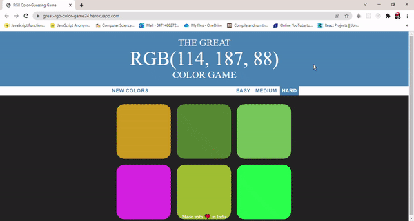

<h1 align="center">RGB Color Game</h1>

- It's not only a great RGB Color Guessing Game but it's also a really nice tool for user to practice RGB colors.
- Just making this project has helped me quite a bit to brush up on some of my RGB skills.

**How it works??**
<br>
- When you load up the page, you get six random colors.
- One of those colors is listed in RGB and the job is to pick which one.
- If you guess wrong, it will go away and it will tell you to try again.Else all six squares come back.They all change to the correct color and the background appear changes to be the correct color as well.
**Just play. Have fun. Enjoy the game.**

<br>

<p align="center">
  
<br >
<br/>

</p>

- Go Test Here : [Site](https://great-rgb-color-game24.herokuapp.com/)

## Getting Started

Start by cloning the repo : 
```sh
git clone https://github.com/dishantagg24/RGB-Color-Game
```
Or Download and extract the zip file.
### Prerequisites

* A modern-web browser like Brave , Chrome , Firefox etc
* Computer..
* At last, Just you and your will....


### Running

1. Double-Click on index.html file or Open it with your favourite browser.

## Built With

* [Javascript](https://www.javascript.com/) - High-level, interpreted programming language
* [HTML](https://www.html.com/) - Standard markup language
* [CSS](https://css.com) - Style sheet language

## Authors

* **[Dishant Aggarwal](https://github.com/dishantagg24)**

## License

This project is licensed under the MIT License - see the [LICENSE.md](https://github.com/dishantagg24/basic-simon-game/blob/master/LICENSE) file for details

## Acknowledgments

* https://www.udemy.com/course/the-web-developer-bootcamp/
